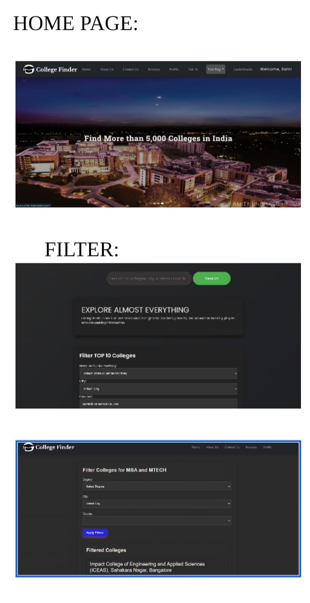
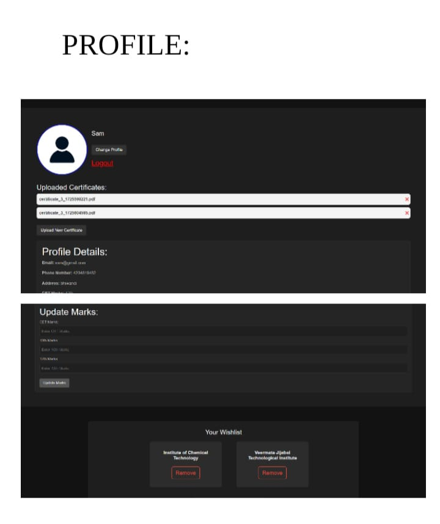
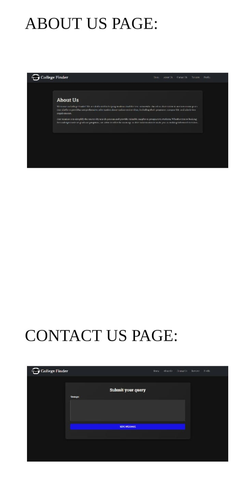

🎓 College Finder – Smart College Recommendation System

Welcome to the **College Finder** project! This application helps students find the best colleges based on their marks, preferences, location, and course interests. It supports personalized college discovery for Engineering, Psychology, and Pharmacy streams.

---

## 🚀 Features

- 🔍 **Stream-Based Navigation** – Choose from Engineering, Psychology, or Pharmacy.
- 🏫 **Advanced College Filtering** – Filter colleges by:
  - State
  - City
  - Course
  - Degree
  - Type (Public/Private)
- ⭐ **Top College Suggestions** – Get colleges ranked by:
  - Highest rating
  - Lowest fees
- 📊 **CET-Based Recommendations** – Input your marks and receive best-fit suggestions.
- 🧠 **Adaptive Algorithm** – Smart suggestion engine based on inputs and backend SQL logic.
- 🌐 **Modern UI** – A clean and aesthetic black-themed user interface.

---

## 🛠️ Tech Stack

### 🔹 Frontend
- HTML5, CSS3, JavaScript
- Tailwind CSS
- React.js

### 🔹 Backend
- PHP
- Flask (For AI logic – optional integration)

### 🔹 Database
- MySQL (hosted on AWS RDS)
  - Host: `database-1.czdvqxctco6l.us-east-1.rds.amazonaws.com`
  - DB Name: `university_finder`

---

## 📁 Project Structure

University_Finder/
├── Engineering/
├── Psychology/
├── Pharmacy/
├── Backend/
│ ├── db_connection.php
│ ├── suggest_colleges.php
├── assets/
├── index.html
├── README.md

yaml
Copy
Edit

---

## 📸 Screenshots

> *(Add your actual screenshots here by uploading them to GitHub and using the markdown below)*

```markdown
### 🔹 Home Page


### 🔹 College Suggestions


### 🔹 Filter Page


⚙️ Setup Instructions
Clone the repository:

bash
Copy
Edit
git clone https://github.com/Shreyasbhalekar18/collegefinder.git
cd collegefinder
Make sure PHP and MySQL are installed.

Run a local server:

bash
Copy
Edit
php -S localhost:8000
Open in browser:

arduino
Copy
Edit
http://localhost:8000
🎯 Future Enhancements
✅ AI-based adaptive suggestion engine

✅ User dashboard with profile and saved colleges

🔄 Feedback-based recommendations

🔒 Authentication & user login

📱 Mobile responsive design

🤝 Contributions
Contributions are welcome! Please open issues or submit pull requests for improvements.

👨‍💻 Developed By
Shreyas Bhalekar
GitHub: @Shreyasbhalekar18

📄 License
This project is licensed under the MIT License.

yaml
Copy
Edit

---

Let me know if you want this in dark theme preview or if you're using it inside a GitHub Pages site — I can adjust it!


